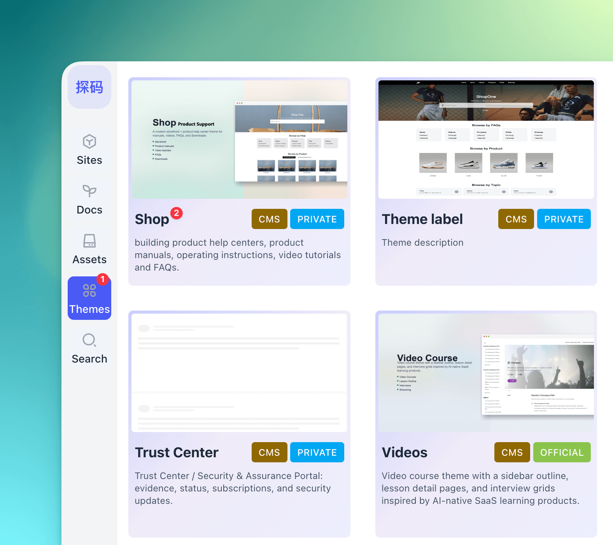
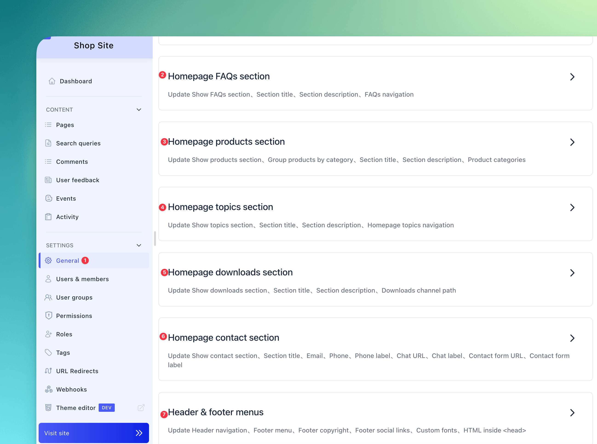
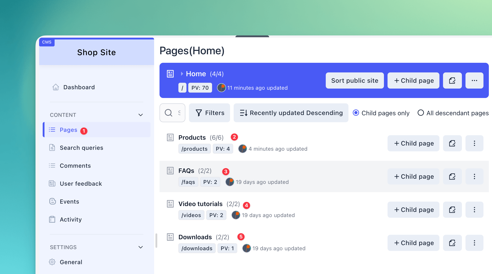

# Baklib CMS — 商城/产品主题（简体中文说明）

面向 Baklib 站点的专业 **产品帮助中心、产品手册、操作说明、视频教程与常见问题（FAQ）** 主题：提供响应式页面设计、产品分类列表展示、带二级页签导航的产品详情页（支持说明书、FAQ、视频、下载等多页签切换）、下载资源卡片、FAQ 折叠列表、AI 搜索与 Tailwind CSS 内置样式。

模板 git 地址：https://github.com/baklib-templates/shop

---

## 功能概览

- **首页**（`templates/index.liquid`）：集成可展开的 AI 搜索框，配置化显示 FAQs、产品、话题、下载和联系我们等多个首页版块，各版块均支持自定义标题和描述。
- **产品详情页**（`templates/product.liquid`）：标题、摘要、封面、富文本详情，集成标签与动态外链按钮（例如“立即购买”或“联系我们”），并提供二级页签，用于快速切换产品相关的子文章（常见问题、使用手册、教程视频、下载资源）。
- **栏目页**：
  - 产品分类展示页 (`templates/products.liquid`)
  - 视频列表与详情页 (`templates/videos.liquid` & `templates/video.liquid`)
  - FAQ 折叠面板页 (`templates/faqs.liquid`)
  - 下载资源列表页 (`templates/downloads.liquid`)
- **配置与翻译**：通过 `config/settings_schema.json` 定义整站后台设置，`locales/*.json` 提供前台 UI 文案翻译，`locales/*.schema.json` 提供后台编辑器标签翻译。

---

## 目录结构

| 路径                          | 说明                                                         |
| ----------------------------- | ------------------------------------------------------------ |
| `templates/`                  | 页面与栏目模板                                               |
| `snippets/`                   | 可复用片段（页头页脚、产品网格、面包屑等）                   |
| `statics/`                    | 静态单页（关于我们、站点地图）                               |
| `layout/`                     | 全站布局模板 `theme.liquid`                                  |
| `config/settings_schema.json` | 主题设置定义                                                 |
| `locales/`                    | 前台文案（`*.json`）与 schema 翻译（`*.schema.json`）        |
| `seeds/`                      | 示例数据与站点包（默认英文）                                 |
| `assets/`                     | 构建后的 CSS/JS 资源                                         |
| `src/`                        | Tailwind CSS 与 JavaScript 源码                              |

---

## 效果预览

|                   首页                    |                  产品详情                     |
| :---------------------------------------: | :-------------------------------------------: |
|  |  |
|               **FAQ 列表**                |                  **视频中心**                 |
|   |     |

---

## 安装教程

在 Baklib 模板市场中找到【Shop】主题，点击安装，并在后台配置相应选项即可。

|                   1. 选择并安装主题                   |                    2. 首页与版块基本设置                      |                    3. 页面与栏目参数配置                       |
| :---------------------------------------------------: | :-----------------------------------------------------------: | :------------------------------------------------------------: |
|  |        |                 |

---

## 其它文档

- 英文总览：[README.md](./README.md)
- 主题帮助：[www.baklib.com/themes](https://www.baklib.com/themes/shop)
